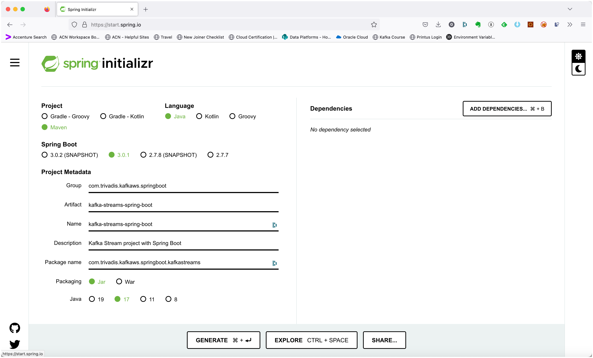

# Using Kafka Streams from Spring Boot for Stream Analytics

In this workshop we will learn how to process messages using the [KafkaStreams](https://kafka.apache.org/documentation/streams/) library from Spring Boot. 

We will create a Spring Boot application and implement the same basic processor from Workshop 8 which consumes messages from a topic, processes them and produces the result into a new topic. We will be using the High-Level DSL.

## Create the Spring Boot Project

First, let’s navigate to [Spring Initializr](https://start.spring.io/) to generate our project. Our project will need the Apache Kafka support. 

Select Generate a **Maven Project** with **Java** and Spring Boot **3.0.1**. Enter `com.trivadis.kafkaws.springboot` for the **Group**, `kafka-streams-spring-boot` for the **Artifact** field and `Kafka Streams Project with Spring Boot` for the **Description** field. 
Change the prefilled **Package Name** to `com.trivadis.kafkaws.springboot.kafkastreams`.



Click on **Add Dependencies** and search for the  **Spring for Apache Kafka** dependency. Select the dependency and hit the **Enter** key. Click on **Add Dependencies** once more and search for the  **Spring for Apache Kafka Streams** dependency and add it as well. 

You should now see the dependency on the right side of the screen.


Click on **Generate Project** and unzip the ZIP file to a convenient location for development. Once you have unzipped the project, you’ll have a very simple structure. 

Import the project as a Maven Project into your favourite IDE for further development. 

## Create the necessary Kafka Topic 

We will use the topic `test-kstream-spring-input-topic` and `test-kstream-spring-output-topic` in the KafkaStream processor code below. Due to the fact that `auto.topic.create.enable` is set to `false`, we have to manually create the topic. 

Connect to the `kafka-1` container and execute the necessary kafka-topics command. 

```bash
docker exec -ti kafka-1 kafka-topics --create \
    --replication-factor 3 \
    --partitions 8 \
    --topic test-kstream-springboot-input-topic \
    --bootstrap-server kafka-1:19092
    
docker exec -ti kafka-1 kafka-topics --create \
    --replication-factor 3 \
    --partitions 8 \
    --topic test-kstream-springboot-output-topic \
    --bootstrap-server kafka-1:19092
```

Next we will implement the KafkaStreams Processor Topology using the DSL and second using the Processor API.

## Implementing the Kafka Streams Processor using the DSL

Create a new Java package `com.trivadis.kafkaws.springboot.kafkastreams` and in it a Java class `KafkaStreamsRunnerDSL`. 

Add the following code for the implementation

```java
package com.trivadis.kafkaws.springboot.kafkastreams;

import org.apache.commons.logging.Log;
import org.apache.commons.logging.LogFactory;
import org.apache.kafka.streams.StreamsBuilder;
import org.apache.kafka.streams.kstream.KStream;
import org.springframework.beans.factory.annotation.Autowired;
import org.springframework.context.annotation.Bean;
import org.springframework.context.annotation.Configuration;
import org.springframework.kafka.annotation.EnableKafkaStreams;
import org.springframework.kafka.config.StreamsBuilderFactoryBean;
import org.springframework.stereotype.Component;

@Component
@EnableKafkaStreams
@Configuration
public class KafkaStreamsRunnerDSL {
    private final Log logger = LogFactory.getLog(getClass());

    @Autowired
    private StreamsBuilderFactoryBean factoryBean;

    private static final String INPUT_TOPIC_NAME = "test-kstream-springboot-input-topic";
    private static final String OUTPUT_TOPIC_NAME = "test-kstream-springboot-output-topic";

    @Bean
    public KStream buildPipeline (StreamsBuilder kStreamBuilder) {

        KStream<Void, String> stream = kStreamBuilder.stream(INPUT_TOPIC_NAME);

        // using peek() to write to debug
        stream.peek((key, value) -> logger.debug("(Input) " + value));

        // transform the values to upper case
        KStream<Void, String> upperStream = stream.mapValues(value -> value.toUpperCase());

        // using peek() to write to debug
        upperStream.peek((key,value) -> logger.debug("(After Transformation) " + value));

        upperStream.to(OUTPUT_TOPIC_NAME);
        return upperStream;
    }
}
```

In standard Spring Boot way, you can see that using Kafka Streams is much simpler than with plain Java. But of course the configuration is still missing. The necessary settings will go into the `application.yml` file.

### Configure Kafka through application.yml configuration file

First let's rename the existing `application.properties` file to `application.yml` to use the `yml` format. 

Add the following settings to configure the Kafka cluster as well as the Kafka Streams application:

```yml
spring:
  application:
    name: "spring-boot-kafkastreams"

  kafka:
    bootstrap-servers: ${DATAPLATFORM_IP}:9092

    streams:
      application-id: ${spring.application.name}
      client-id: ${spring.application.name}-stream
      properties:
        default.key.serde: org.apache.kafka.common.serialization.Serdes$VoidSerde
        default.value.serde: org.apache.kafka.common.serialization.Serdes$StringSerde
        # This is the default: log, fail and stop processing records (stop stream)
        default.deserialization.exception.handler: org.apache.kafka.streams.errors.LogAndFailExceptionHandler
    properties:
      bootstrap.servers: ${spring.kafka.bootstrap-servers}

    # At application startup a missing topic on the broker will not fail the
    # application startup
    listener:
      missing-topics-fatal: false

logging:
  level:
    root: info
    com.trivadis.kafkaws.springboot.kafkastreams: debug
```

For the IP address of the Kafka cluster we refer to an environment variable, which we have to declare before running the application.

```bash
export DATAPLATFORM_IP=nnn.nnn.nnn.nnn
```

## Build & Run the application

First lets build the application:

```bash
mvn package -Dmaven.test.skip=true
```

Now let's run the application

```bash
mvn spring-boot:run
```

## Use Console to test the application

Start the programm and then first run a `kcat` consumer on the output topic

```bash
kcat -b dataplatform:9092 -t test-kstream-springboot-output-topic
```

with that in place, in 2nd terminal produce some messages using `kcat` in producer mode on the input topic

```bash
kcat -b dataplatform:9092 -t test-kstream-springboot-input-topic -P
```

All the values produced should arrive on the consumer in uppercase.

## Unit Testing Kafka Streams using `TopologyTestDriver`

Now let's add a unit test using the `kafka-streams-test-utils` library which is part of the [Apache Kafka](https://kafka.apache.org/33/documentation/streams/developer-guide/testing.html).

The test-utils package provides a `TopologyTestDriver` that can be used pipe data through a Topology that is either assembled manually using Processor API or via the DSL using StreamsBuilder. The test driver simulates the library runtime that continuously fetches records from input topics and processes them by traversing the topology. This way we can test the topology without having to run the Spring Boot application and without connectivity to a Kafka cluster.

Now let's implement the unit test 

```java
package com.trivadis.kafkaws.springboot.kafkastreams;

import org.apache.kafka.common.serialization.Serde;
import org.apache.kafka.common.serialization.Serdes;
import org.apache.kafka.streams.*;
import org.apache.kafka.streams.kstream.Consumed;
import org.apache.kafka.streams.kstream.KStream;
import org.apache.kafka.test.TestUtils;
import org.junit.jupiter.api.AfterEach;
import org.junit.jupiter.api.BeforeEach;
import org.junit.jupiter.api.Test;

import java.util.List;
import java.util.Properties;
import java.util.UUID;

import static org.assertj.core.api.Assertions.assertThat;

public class KafkaStreamsRunnerDSLTest {

    private TopologyTestDriver testDriver = null;
    private static final String INPUT_TOPIC = "test-kstream-springboot-input-topic";
    private static final String OUTPUT_TOPIC = "test-kstream-springboot-output-topic";
    private TestInputTopic inputTopic;
    private TestOutputTopic outputTopic;

    final Serde<String> stringSerde = Serdes.String();
    final Serde<Void> voidSerde = Serdes.Void();
    private static Properties getStreamsConfig(final Serde<?> keyDeserializer,
                                               final Serde<?> valueDeserializer) {
        final Properties props = new Properties();
        props.put(StreamsConfig.APPLICATION_ID_CONFIG, UUID.randomUUID().toString());
        props.put(StreamsConfig.BOOTSTRAP_SERVERS_CONFIG, "dummy:9092");
        props.put(StreamsConfig.DEFAULT_KEY_SERDE_CLASS_CONFIG, keyDeserializer.getClass().getName());
        props.put(StreamsConfig.DEFAULT_VALUE_SERDE_CLASS_CONFIG, valueDeserializer.getClass().getName());
        props.put(StreamsConfig.STATE_DIR_CONFIG, TestUtils.tempDirectory().getPath());
        return props;
    }

    private void buildStreamProcessingPipeline(StreamsBuilder builder) {
        KStream<Void, String> input = builder.stream(INPUT_TOPIC, Consumed.with(voidSerde, stringSerde));
        KafkaStreamsRunnerDSL app = new KafkaStreamsRunnerDSL();

        app.buildPipeline(builder);
    }

    /**
     * Setup Stream topology
     * Add KStream based on @StreamListener annotation
     * Add to(topic) based @SendTo annotation
     */
    @BeforeEach
    public void setup() {
        final StreamsBuilder builder = new StreamsBuilder();
        buildStreamProcessingPipeline(builder);

        final Properties props = getStreamsConfig(Serdes.Void(), Serdes.String());
        testDriver = new TopologyTestDriver(builder.build(), props);
        inputTopic = testDriver.createInputTopic(INPUT_TOPIC, voidSerde.serializer(), stringSerde.serializer());
        outputTopic = testDriver.createOutputTopic(OUTPUT_TOPIC, voidSerde.deserializer(), stringSerde.deserializer());
    }

    @AfterEach
    public void tearDown() {
        try {
            testDriver.close();
        } catch (RuntimeException e) {
            // https://issues.apache.org/jira/browse/KAFKA-6647 causes exception when executed in Windows, ignoring it
            // Logged stacktrace cannot be avoided
            System.out.println("Ignoring exception, test failing in Windows due this exception:" + e.getLocalizedMessage());
        }
    }

    @Test
    void shouldUpperCaseOne() {
        final Void voidKey = null;
        String VALUE = "hello";

        inputTopic.pipeInput(voidKey, VALUE, 1L);

        final Object value = outputTopic.readValue();

        // assert that the output has a value in uppercase
        assertThat(value).isNotNull();
        assertThat(value).isEqualTo(VALUE.toUpperCase());

        // no more data in topic
        assertThat(outputTopic.isEmpty()).isTrue();
    }

    @Test
    void shouldUpperCaseMany() {
        final Void voidKey = null;
        String VALUE1 = "hello";
        String VALUE2 = "world";

        inputTopic.pipeInput(voidKey, VALUE1, 1L);
        inputTopic.pipeInput(voidKey, VALUE2, 2L);

        final List<KeyValue<Void,String>> values = outputTopic.readKeyValuesToList();

        // assert that the output has a value in uppercase
        assertThat(values).isNotNull();
        assertThat(values).contains(new KeyValue<>(voidKey, VALUE1.toUpperCase()));
        assertThat(values).contains(new KeyValue<>(voidKey, VALUE2.toUpperCase()));

        // no more data in topic
        assertThat(outputTopic.isEmpty()).isTrue();

    }

}
```

We also have to configure the logging. Create a file `test/resources/logback.xml` and add the following

```xml
<?xml version="1.0" encoding="UTF-8"?>
<configuration>
    <appender name="stdout" class="ch.qos.logback.core.ConsoleAppender">
        <encoder>
            <pattern>%d{ISO8601} %5p %t %c{2}:%L - %m%n</pattern>
        </encoder>
    </appender>
    <root level="INFO">
        <appender-ref ref="stdout"/>
    </root>
    <logger name="org.apache.kafka.streams.processor.internals" level="WARN"/>
</configuration>
```

Now run the unit test either from the Java IDE or by using `mvn test`. 


----

```java

    @Bean
    KafkaStreamsCustomizer getKafkaStreamsCustomizer() {
        return kafkaStreams -> kafkaStreams.setStateListener((newState, oldState) -> {
            if (newState == KafkaStreams.State.RUNNING) {
                LOG.info("Streams now in running state");
                kafkaStreams.localThreadsMetadata().forEach(tm -> LOG.info("{} assignments {}", tm.threadName(), tm.activeTasks()));
            }
        });
    }


    @Bean
    StreamsBuilderFactoryBeanCustomizer kafkaStreamsCustomizer() {
        return  streamsFactoryBean -> streamsFactoryBean.setKafkaStreamsCustomizer(getKafkaStreamsCustomizer());
    }
```