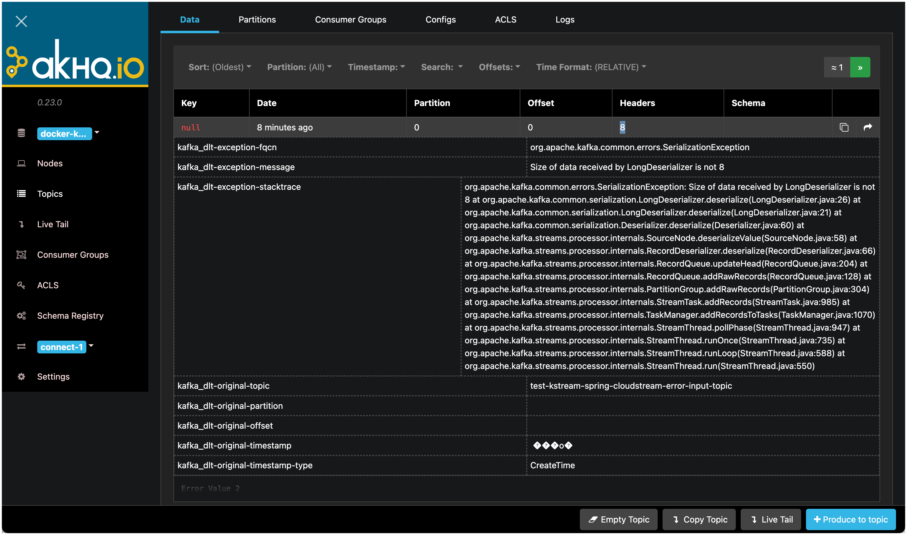

# Error Handling with Spring Boot & Spring Cloud Stream

In this workshop we will learn how to process messages using the [Kafka Streams Binder of Spring Cloud Stream](https://docs.spring.io/spring-cloud-stream/docs/current/reference/html/spring-cloud-stream-binder-kafka.html#_kafka_streams_binder) from Spring Boot. 

We will create a Spring Boot application and implement the same basic processor from Workshop 8 which consumes messages from a topic, processes them and produces the result into a new topic. We will be using the High-Level DSL.

## Create the Spring Boot Project

First, let’s navigate to [Spring Initializr](https://start.spring.io/) to generate our project. Our project will need the Apache Kafka support. 

Select Generate a **Maven Project** with **Java** and Spring Boot **3.0.1**. Enter `com.trivadis.kafkaws.springboot` for the **Group**, `spring-cloudstream-kafkastreams-error` for the **Artifact** field, `Kafka Streams project with Spring Boot and Cloud Stream with Error Handling` for the **Description** field and adapt the **Package Name** to `com.trivadis.kafkaws.springboot.cloudstream.kafkastreams`. 


Click on **Add Dependencies** and search for the  **Cloud Stream** dependency. Select the dependency and hit the **Enter** key. Click on **Add Dependencies** once more and search for the  **Spring for Apache Kafka Streams** dependency and add it as well.
You should now see the dependency on the right side of the screen.


Click on **Generate Project** and unzip the ZIP file to a convenient location for development. Once you have unzipped the project, you’ll have a very simple structure. 

Import the project as a Maven Project into your favourite IDE for further development. 

## Create the necessary Kafka Topic 

We will use the topic `test-kstream-spring-input-error-topic` and `test-kstream-spring-output-error-topic` in the KafkaStream processorcode below. Due to the fact that `auto.topic.create.enable` is set to `false`, we have to manually create the topic. 

Connect to the `kafka-1` container and execute the necessary kafka-topics command. 

```bash
docker exec -ti kafka-1 kafka-topics --create \
    --replication-factor 3 \
    --partitions 8 \
    --topic test-kstream-spring-cloudstream-error-input-topic \
    --bootstrap-server kafka-1:19092
    
docker exec -ti kafka-1 kafka-topics --create \
    --replication-factor 3 \
    --partitions 8 \
    --topic test-kstream-spring-cloudstream-error-output-topic \
    --bootstrap-server kafka-1:19092
```

Next we will implement the KafkaStreams Processor Topology using the DSL and second using the Processor API.

## Implementing Kafka Streams Processor using the DSL

Create a new Java package `com.trivadis.kafkws.springboot.cloudstream.kafkastreams ` and in it a Java class `KafkaStreamsRunnerDSL`. 

Add the following code for the implementation

```java
package com.trivadis.kafkws.springboot.cloudstream.kafkastreams;

import org.apache.commons.logging.Log;
import org.apache.commons.logging.LogFactory;
import org.apache.kafka.streams.kstream.KStream;
import org.apache.kafka.streams.kstream.Printed;
import org.springframework.cloud.stream.binder.kafka.utils.DlqPartitionFunction;
import org.springframework.context.annotation.Bean;
import org.springframework.kafka.core.CleanupConfig;
import org.springframework.stereotype.Component;

import java.util.function.Function;

@Component
public class KafkaStreamsRunnerDSL {
    private final Log logger = LogFactory.getLog(getClass());

    @Bean
    public Function<KStream<Void, Long>, KStream<Void, String>> process() {
        return input -> input.mapValues(value -> String.valueOf(value * 2) );
    }
}

```

It implements a very simplified Topology, accepting a `Long` value on the input, multiplying it by `2` and returning it as a `String` value (so that it is easier to check it using AKHQ, as the tools don't support visualizing a Kafka message with a value of type `Long`). 

The point of using `Long` for the datatype of the value for the input topic is, that by that we can easily force a Deserialisation error by sending a value of type `String` using `kcat`.

### Configure Kafka through application.yml configuration file

First let's rename the existing `application.properties` file to `application.yml` to use the `yml` format. 

Add the following settings to configure the Kafka cluster as well as the Kafka Streams application:

```yml
spring:
  application:
    name: "cloudstream-kafkastreams-error"

  cloud:
    stream:
      bindings:
        process-in-0:
          destination: test-kstream-spring-cloudstream-error-input-topic
        process-out-0:
          destination: test-kstream-spring-cloudstream-error-output-topic

      kafka:
        streams.binder:
          applicationId: spring-boot-springcloud-kafkastreams
          configuration:
            commit.interval.ms: 100
            cache.max.bytes.buffering: 0
            default.key.serde: org.apache.kafka.common.serialization.Serdes$VoidSerde
            default.value.serde: org.apache.kafka.common.serialization.Serdes$LongSerde
          deserializationExceptionHandler: sendToDlq
  kafka:
    bootstrap-servers: dataplatform:9092

logging:
  level:
    root: info
```

For the IP address of the Kafka cluster we refer to an environment variable, which we have to declare before running the application.

```bash
export DATAPLATFORM_IP=nnn.nnn.nnn.nnn
```

## Create a Java Unit Test for producing a valid message 

Create a class in `src/test` which produces a valid message using the `spring-kafka` abstraction:

```java
package com.trivadis.kafkws.springboot.cloudstream.kafkastreams;

import org.apache.kafka.clients.producer.ProducerConfig;
import org.apache.kafka.common.serialization.LongSerializer;
import org.apache.kafka.common.serialization.VoidSerializer;
import org.junit.jupiter.api.Test;
import org.springframework.kafka.core.DefaultKafkaProducerFactory;
import org.springframework.kafka.core.KafkaTemplate;

import java.util.HashMap;
import java.util.Map;

public class ProducerTest {

    @Test
    public void produceOneMessage() {

        Map<String, Object> props = new HashMap<>();
        props.put(ProducerConfig.BOOTSTRAP_SERVERS_CONFIG, "dataplatform:9092");
        props.put(ProducerConfig.RETRIES_CONFIG, 0);
        props.put(ProducerConfig.BATCH_SIZE_CONFIG, 16384);
        props.put(ProducerConfig.LINGER_MS_CONFIG, 1);
        props.put(ProducerConfig.BUFFER_MEMORY_CONFIG, 33554432);
        props.put(ProducerConfig.KEY_SERIALIZER_CLASS_CONFIG, VoidSerializer.class);
        props.put(ProducerConfig.VALUE_SERIALIZER_CLASS_CONFIG, LongSerializer.class);

        DefaultKafkaProducerFactory<String, Long> pf = new DefaultKafkaProducerFactory<>(props);
        KafkaTemplate<String, Long> template = new KafkaTemplate<>(pf, true);
        template.setDefaultTopic("test-kstream-spring-cloudstream-error-input-topic");

        template.sendDefault(1L);
    }
}
```

We just send a value of `1` to the input topic.


## Build & Run the application

First lets build the application:

```bash
mvn package -Dmaven.test.skip=true
```

Now let's run the application

```bash
mvn spring-boot:run
```

## Test the application

### Use `kcat` to consume from the output topic

Start the program and then first run a `kcat` consumer on the output topic

```bash
kcat -b dataplatform:9092 -t test-kstream-spring-cloudstream-error-output-topic
```

### Run the Test to produce a valid message

Run the unit test either from your IDE or using Maven:

```bash
mvn test
```

You should see a message on the `kcat` output, showing that the topology works:

```bash
docker@ubuntu:~$ kcat -b dataplatform:9092 -t test-kstream-spring-cloudstream-error-output-topic -q
2
```

## Forcing a Deserialization error

Now let's create an error on Deserialisation by sending a value of type `String`. We could write another Unit test but we can also easily do that using `kcat`. 

```bash
kcat -b dataplatform:9092 -t test-kstream-spring-cloudstream-error-input-topic -P
```

Enter a string value and you will immediately get an `org.apache.kafka.common.errors.SerializationException` and the application is stopped:

```
g-boot-springcloud-kafkastreams] Requesting the log end offset for test-kstream-spring-cloudstream-error-input-topic-7 in order to compute lag
2023-01-08T20:16:21.740+01:00 ERROR 36551 --- [-StreamThread-1] o.a.k.s.e.LogAndFailExceptionHandler     : Exception caught during Deserialization, taskId: 0_1, topic: test-kstream-spring-cloudstream-error-input-topic, partition: 1, offset: 0

org.apache.kafka.common.errors.SerializationException: Size of data received by LongDeserializer is not 8
        at org.apache.kafka.common.serialization.LongDeserializer.deserialize(LongDeserializer.java:26) ~[kafka-clients-3.3.1.jar:na]
        at org.apache.kafka.common.serialization.LongDeserializer.deserialize(LongDeserializer.java:21) ~[kafka-clients-3.3.1.jar:na]
        at org.apache.kafka.common.serialization.Deserializer.deserialize(Deserializer.java:60) ~[kafka-clients-3.3.1.jar:na]
        at org.apache.kafka.streams.processor.internals.SourceNode.deserializeValue(SourceNode.java:58) ~[kafka-streams-3.3.1.jar:na]
        at org.apache.kafka.streams.processor.internals.RecordDeserializer.deserialize(RecordDeserializer.java:66) ~[kafka-streams-3.3.1.jar:na]
        at org.apache.kafka.streams.processor.internals.RecordQueue.updateHead(RecordQueue.java:204) ~[kafka-streams-3.3.1.jar:na]
        at org.apache.kafka.streams.processor.internals.RecordQueue.addRawRecords(RecordQueue.java:128) ~[kafka-streams-3.3.1.jar:na]
        at org.apache.kafka.streams.processor.internals.PartitionGroup.addRawRecords(PartitionGroup.java:304) ~[kafka-streams-3.3.1.jar:na]
        at org.apache.kafka.streams.processor.internals.StreamTask.addRecords(StreamTask.java:985) ~[kafka-streams-3.3.1.jar:na]
        at org.apache.kafka.streams.processor.internals.TaskManager.addRecordsToTasks(TaskManager.java:1070) ~[kafka-streams-3.3.1.jar:na]
        at org.apache.kafka.streams.processor.internals.StreamThread.pollPhase(StreamThread.java:947) ~[kafka-streams-3.3.1.jar:na]
        at org.apache.kafka.streams.processor.internals.StreamThread.runOnce(StreamThread.java:735) ~[kafka-streams-3.3.1.jar:na]
        at org.apache.kafka.streams.processor.internals.StreamThread.runLoop(StreamThread.java:588) ~[kafka-streams-3.3.1.jar:na]
        at org.apache.kafka.streams.processor.internals.StreamThread.run(StreamThread.java:550) ~[kafka-streams-3.3.1.jar:na]

2023-01-08T20:16:21.741+01:00 ERROR 36551 --- [-StreamThread-1] org.apache.kafka.streams.KafkaStreams    : stream-client [spring-boot-springcloud-kafkastreams-da80d1fc-cd0d-44e0-af3b-653ca169209a] Encountered the following exception during processing and the registered exception handler opted to SHUTDOWN_CLIENT. The streams client is going to shut down now. 

org.apache.kafka.streams.errors.StreamsException: Deserialization exception handler is set to fail upon a deserialization error. If you would rather have the streaming pipeline continue after a deserialization error, please set the default.deserialization.exception.handler appropriately.
        at org.apache.kafka.streams.processor.internals.RecordDeserializer.deserialize(RecordDeserializer.java:86) ~[kafka-streams-3.3.1.jar:na]
        at org.apache.kafka.streams.processor.internals.RecordQueue.updateHead(RecordQueue.java:204) ~[kafka-streams-3.3.1.jar:na]
        at org.apache.kafka.streams.processor.internals.RecordQueue.addRawRecords(RecordQueue.java:128) ~[kafka-streams-3.3.1.jar:na]
        at org.apache.kafka.streams.processor.internals.PartitionGroup.addRawRecords(PartitionGroup.java:304) ~[kafka-streams-3.3.1.jar:na]
        at org.apache.kafka.streams.processor.internals.StreamTask.addRecords(StreamTask.java:985) ~[kafka-streams-3.3.1.jar:na]
        at org.apache.kafka.streams.processor.internals.TaskManager.addRecordsToTasks(TaskManager.java:1070) ~[kafka-streams-3.3.1.jar:na]
        at org.apache.kafka.streams.processor.internals.StreamThread.pollPhase(StreamThread.java:947) ~[kafka-streams-3.3.1.jar:na]
        at org.apache.kafka.streams.processor.internals.StreamThread.runOnce(StreamThread.java:735) ~[kafka-streams-3.3.1.jar:na]
        at org.apache.kafka.streams.processor.internals.StreamThread.runLoop(StreamThread.java:588) ~[kafka-streams-3.3.1.jar:na]
        at org.apache.kafka.streams.processor.internals.StreamThread.run(StreamThread.java:550) ~[kafka-streams-3.3.1.jar:na]
Caused by: org.apache.kafka.common.errors.SerializationException: Size of data received by LongDeserializer is not 8
        at org.apache.kafka.common.serialization.LongDeserializer.deserialize(LongDeserializer.java:26) ~[kafka-clients-3.3.1.jar:na]
        at org.apache.kafka.common.serialization.LongDeserializer.deserialize(LongDeserializer.java:21) ~[kafka-clients-3.3.1.jar:na]
        at org.apache.kafka.common.serialization.Deserializer.deserialize(Deserializer.java:60) ~[kafka-clients-3.3.1.jar:na]
        at org.apache.kafka.streams.processor.internals.SourceNode.deserializeValue(SourceNode.java:58) ~[kafka-streams-3.3.1.jar:na]
        at org.apache.kafka.streams.processor.internals.RecordDeserializer.deserialize(RecordDeserializer.java:66) ~[kafka-streams-3.3.1.jar:na]
        ... 9 common frames omitted

2023-01-08T20:16:21.742+01:00  INFO 36551 --- [-StreamThread-1] org.apache.kafka.streams.KafkaStreams    : stream-client [spring-boot-springcloud-kafkastreams-da80d1fc-cd0d-44e0-af3b-653ca169209a] State transition from RUNNING to PENDING_ERROR
2023-01-08T20:16:21.744+01:00  INFO 36551 --- [-StreamThread-1] o.a.k.s.p.internals.StreamThread         : stream-thread [spring-boot-springcloud-kafkastreams-da80d1fc-cd0d-44e0-af3b-653ca169209a-StreamThread-1] State transition from RUNNING to PENDING_SHUTDOWN
2023-01-08T20:16:21.744+01:00  INFO 36551 --- [-StreamThread-1] o.a.k.s.p.internals.StreamThread         : stream-thread [spring-boot-springcloud-kafkastreams-da80d1fc-cd0d-44e0-af3b-653ca169209a-StreamThread-1] Shutting down
2023-01-08T20:16:21.744+01:00  INFO 36551 --- [09a-CloseThread] o.a.k.s.p.internals.StreamThread         : stream-thread [spring-boot-springcloud-kafkastreams-da80d1fc-cd0d-44e0-af3b-653ca169209a-StreamThread-1] Informed to shut down
2023-01-08T20:16:21.744+01:00  INFO 36551 --- [09a-CloseThread] org.apache.kafka.streams.KafkaStreams    : stream-client [spring-boot-springcloud-kafkastreams-da80d1fc-cd0d-44e0-af3b-653ca169209a] Shutting down 1 stream threads
2023-01-08T20:16:21.744+01:00  INFO 36551 --- [-StreamThread-1] o.a.k.s.processor.internals.StreamTask   : stream-thread [spring-boot-springcloud-kafkastreams-da80d1fc-cd0d-44e0-af3b-653ca169209a-StreamThread-1] task [0_3] Suspended RUNNING
2023-01-08T20:16:21.744+01:00  INFO 36551 --- [-StreamThread-1] o.a.k.s.processor.internals.StreamTask   : stream-thread [spring-boot-springcloud-kafkastreams-da80d1fc-cd0d-44e0-af3b-653ca169209a-StreamThread-1] task [0_3] Suspended running
2023-01-08T20:16:21.745+01:00  INFO 36551 --- [-StreamThread-1] o.a.k.clients.consumer.KafkaConsumer     : [Consumer clientId=spring-boot-springcloud-kafkastreams-da80d1fc-cd0d-44e0-af3b-653ca169209a-StreamThread-1-restore-consumer, groupId=null] Unsubscribed all topics or patterns and assigned partitions
2023-01-08T20:16:21.745+01:00  INFO 36551 --- [-StreamThread-1] o.a.k.s.p.internals.RecordCollectorImpl  : stream-thread [spring-boot-springcloud-kafkastreams-da80d1fc-cd0d-44e0-af3b-653ca169209a-StreamThread-1] task [0_3] Closing record collector dirty
2023-01-08T20:16:21.745+01:00  INFO 36551 --- [-StreamThread-1] o.a.k.s.processor.internals.StreamTask   : stream-thread [spring-boot-springcloud-kafkastreams-da80d1fc-cd0d-44e0-af3b-653ca169209a-StreamThread-1] task [0_3] Closed dirty
2023-01-08T20:16:21.746+01:00  INFO 36551 --- [-StreamThread-1] o.a.k.s.processor.internals.StreamTask   : stream-thread [spring-boot-springcloud-kafkastreams-da80d1fc-cd0d-44e0-af3b-653ca169209a-StreamThread-1] task [0_4] Suspended RUNNING
2023-01-08T20:16:21.746+01:00  INFO 36551 --- [-StreamThread-1] o.a.k.s.processor.internals.StreamTask   : stream-thread [spring-boot-springcloud-kafkastreams-da80d1fc-cd0d-44e0-af3b-653ca169209a-StreamThread-1] task [0_4] Suspended running
2023-01-08T20:16:21.746+01:00  INFO 36551 --- [-StreamThread-1] o.a.k.clients.consumer.KafkaConsumer     : [Consumer clientId=spring-boot-springcloud-kafkastreams-da80d1fc-cd0d-44e0-af3b-653ca169209a-StreamThread-1-restore-consumer, groupId=null] Unsubscribed all topics or patterns and assigned partitions
2023-01-08T20:16:21.746+01:00  INFO 36551 --- [-StreamThread-1] o.a.k.s.p.internals.RecordCollectorImpl  : stream-thread [spring-boot-springcloud-kafkastreams-da80d1fc-cd0d-44e0-af3b-653ca169209a-StreamThread-1] task [0_4] Closing record collector dirty
2023-01-08T20:16:21.746+01:00  INFO 36551 --- [-StreamThread-1] o.a.k.s.processor.internals.StreamTask   : stream-thread [spring-boot-springcloud-kafkastreams-da80d1fc-cd0d-44e0-af3b-653ca169209a-StreamThread-1] task [0_4] Closed dirty
2023-01-08T20:16:21.746+01:00  INFO 36551 --- [-StreamThread-1] o.a.k.s.processor.internals.StreamTask   : stream-thread [spring-boot-springcloud-kafkastreams-da80d1fc-cd0d-44e0-af3b-653ca169209a-StreamThread-1] task [0_0] Suspended RUNNING
2023-01-08T20:16:21.746+01:00  INFO 36551 --- [-StreamThread-1] o.a.k.s.processor.internals.StreamTask   : stream-thread [spring-boot-springcloud-kafkastreams-da80d1fc-cd0d-44e0-af3b-653ca169209a-StreamThread-1] task [0_0] Suspended running
2023-01-08T20:16:21.747+01:00  INFO 36551 --- [-StreamThread-1] o.a.k.clients.consumer.KafkaConsumer     : [Consumer clientId=spring-boot-springcloud-kafkastreams-da80d1fc-cd0d-44e0-af3b-653ca169209a-StreamThread-1-restore-consumer, groupId=null] Unsubscribed all topics or patterns and assigned partitions
2023-01-08T20:16:21.747+01:00  INFO 36551 --- [-StreamThread-1] o.a.k.s.p.internals.RecordCollectorImpl  : stream-thread [spring-boot-springcloud-kafkastreams-da80d1fc-cd0d-44e0-af3b-653ca169209a-StreamThread-1] task [0_0] Closing record collector dirty
2023-01-08T20:16:21.747+01:00  INFO 36551 --- [-StreamThread-1] o.a.k.s.processor.internals.StreamTask   : stream-thread [spring-boot-springcloud-kafkastreams-da80d1fc-cd0d-44e0-af3b-653ca169209a-StreamThread-1] task [0_0] Closed dirty
2023-01-08T20:16:21.747+01:00  INFO 36551 --- [-StreamThread-1] o.a.k.s.processor.internals.StreamTask   : stream-thread [spring-boot-springcloud-kafkastreams-da80d1fc-cd0d-44e0-af3b-653ca169209a-StreamThread-1] task [0_7] Suspended RUNNING
2023-01-08T20:16:21.747+01:00  INFO 36551 --- [-StreamThread-1] o.a.k.s.processor.internals.StreamTask   : stream-thread [spring-boot-springcloud-kafkastreams-da80d1fc-cd0d-44e0-af3b-653ca169209a-StreamThread-1] task [0_7] Suspended running
2023-01-08T20:16:21.748+01:00  INFO 36551 --- [-StreamThread-1] o.a.k.clients.consumer.KafkaConsumer     : [Consumer clientId=spring-boot-springcloud-kafkastreams-da80d1fc-cd0d-44e0-af3b-653ca169209a-StreamThread-1-restore-consumer, groupId=null] Unsubscribed all topics or patterns and assigned partitions
2023-01-08T20:16:21.748+01:00  INFO 36551 --- [-StreamThread-1] o.a.k.s.p.internals.RecordCollectorImpl  : stream-thread [spring-boot-springcloud-kafkastreams-da80d1fc-cd0d-44e0-af3b-653ca169209a-StreamThread-1] task [0_7] Closing record collector dirty
2023-01-08T20:16:21.748+01:00  INFO 36551 --- [-StreamThread-1] o.a.k.s.processor.internals.StreamTask   : stream-thread [spring-boot-springcloud-kafkastreams-da80d1fc-cd0d-44e0-af3b-653ca169209a-StreamThread-1] task [0_7] Closed dirty
2023-01-08T20:16:21.748+01:00  INFO 36551 --- [-StreamThread-1] o.a.k.s.processor.internals.StreamTask   : stream-thread [spring-boot-springcloud-kafkastreams-da80d1fc-cd0d-44e0-af3b-653ca169209a-StreamThread-1] task [0_1] Suspended RUNNING
2023-01-08T20:16:21.749+01:00  INFO 36551 --- [-StreamThread-1] o.a.k.s.processor.internals.StreamTask   : stream-thread [spring-boot-springcloud-kafkastreams-da80d1fc-cd0d-44e0-af3b-653ca169209a-StreamThread-1] task [0_1] Suspended running
2023-01-08T20:16:21.749+01:00  INFO 36551 --- [-StreamThread-1] o.a.k.clients.consumer.KafkaConsumer     : [Consumer clientId=spring-boot-springcloud-kafkastreams-da80d1fc-cd0d-44e0-af3b-653ca169209a-StreamThread-1-restore-consumer, groupId=null] Unsubscribed all topics or patterns and assigned partitions
2023-01-08T20:16:21.749+01:00  INFO 36551 --- [-StreamThread-1] o.a.k.s.p.internals.RecordCollectorImpl  : stream-thread [spring-boot-springcloud-kafkastreams-da80d1fc-cd0d-44e0-af3b-653ca169209a-StreamThread-1] task [0_1] Closing record collector dirty
2023-01-08T20:16:21.749+01:00  INFO 36551 --- [-StreamThread-1] o.a.k.s.processor.internals.StreamTask   : stream-thread [spring-boot-springcloud-kafkastreams-da80d1fc-cd0d-44e0-af3b-653ca169209a-StreamThread-1] task [0_1] Closed dirty
2023-01-08T20:16:21.749+01:00  INFO 36551 --- [-StreamThread-1] o.a.k.s.processor.internals.StreamTask   : stream-thread [spring-boot-springcloud-kafkastreams-da80d1fc-cd0d-44e0-af3b-653ca169209a-StreamThread-1] task [0_6] Suspended RUNNING
2023-01-08T20:16:21.749+01:00  INFO 36551 --- [-StreamThread-1] o.a.k.s.processor.internals.StreamTask   : stream-thread [spring-boot-springcloud-kafkastreams-da80d1fc-cd0d-44e0-af3b-653ca169209a-StreamThread-1] task [0_6] Suspended running
2023-01-08T20:16:21.750+01:00  INFO 36551 --- [-StreamThread-1] o.a.k.clients.consumer.KafkaConsumer     : [Consumer clientId=spring-boot-springcloud-kafkastreams-da80d1fc-cd0d-44e0-af3b-653ca169209a-StreamThread-1-restore-consumer, groupId=null] Unsubscribed all topics or patterns and assigned partitions
2023-01-08T20:16:21.750+01:00  INFO 36551 --- [-StreamThread-1] o.a.k.s.p.internals.RecordCollectorImpl  : stream-thread [spring-boot-springcloud-kafkastreams-da80d1fc-cd0d-44e0-af3b-653ca169209a-StreamThread-1] task [0_6] Closing record collector dirty
2023-01-08T20:16:21.750+01:00  INFO 36551 --- [-StreamThread-1] o.a.k.s.processor.internals.StreamTask   : stream-thread [spring-boot-springcloud-kafkastreams-da80d1fc-cd0d-44e0-af3b-653ca169209a-StreamThread-1] task [0_6] Closed dirty
2023-01-08T20:16:21.751+01:00  INFO 36551 --- [-StreamThread-1] o.a.k.s.processor.internals.StreamTask   : stream-thread [spring-boot-springcloud-kafkastreams-da80d1fc-cd0d-44e0-af3b-653ca169209a-StreamThread-1] task [0_2] Suspended RUNNING
2023-01-08T20:16:21.751+01:00  INFO 36551 --- [-StreamThread-1] o.a.k.s.processor.internals.StreamTask   : stream-thread [spring-boot-springcloud-kafkastreams-da80d1fc-cd0d-44e0-af3b-653ca169209a-StreamThread-1] task [0_2] Suspended running
2023-01-08T20:16:21.751+01:00  INFO 36551 --- [-StreamThread-1] o.a.k.clients.consumer.KafkaConsumer     : [Consumer clientId=spring-boot-springcloud-kafkastreams-da80d1fc-cd0d-44e0-af3b-653ca169209a-StreamThread-1-restore-consumer, groupId=null] Unsubscribed all topics or patterns and assigned partitions
2023-01-08T20:16:21.751+01:00  INFO 36551 --- [-StreamThread-1] o.a.k.s.p.internals.RecordCollectorImpl  : stream-thread [spring-boot-springcloud-kafkastreams-da80d1fc-cd0d-44e0-af3b-653ca169209a-StreamThread-1] task [0_2] Closing record collector dirty
2023-01-08T20:16:21.751+01:00  INFO 36551 --- [-StreamThread-1] o.a.k.s.processor.internals.StreamTask   : stream-thread [spring-boot-springcloud-kafkastreams-da80d1fc-cd0d-44e0-af3b-653ca169209a-StreamThread-1] task [0_2] Closed dirty
2023-01-08T20:16:21.751+01:00  INFO 36551 --- [-StreamThread-1] o.a.k.s.processor.internals.StreamTask   : stream-thread [spring-boot-springcloud-kafkastreams-da80d1fc-cd0d-44e0-af3b-653ca169209a-StreamThread-1] task [0_5] Suspended RUNNING
2023-01-08T20:16:21.752+01:00  INFO 36551 --- [-StreamThread-1] o.a.k.s.processor.internals.StreamTask   : stream-thread [spring-boot-springcloud-kafkastreams-da80d1fc-cd0d-44e0-af3b-653ca169209a-StreamThread-1] task [0_5] Suspended running
2023-01-08T20:16:21.752+01:00  INFO 36551 --- [-StreamThread-1] o.a.k.clients.consumer.KafkaConsumer     : [Consumer clientId=spring-boot-springcloud-kafkastreams-da80d1fc-cd0d-44e0-af3b-653ca169209a-StreamThread-1-restore-consumer, groupId=null] Unsubscribed all topics or patterns and assigned partitions
2023-01-08T20:16:21.752+01:00  INFO 36551 --- [-StreamThread-1] o.a.k.s.p.internals.RecordCollectorImpl  : stream-thread [spring-boot-springcloud-kafkastreams-da80d1fc-cd0d-44e0-af3b-653ca169209a-StreamThread-1] task [0_5] Closing record collector dirty
2023-01-08T20:16:21.752+01:00  INFO 36551 --- [-StreamThread-1] o.a.k.s.processor.internals.StreamTask   : stream-thread [spring-boot-springcloud-kafkastreams-da80d1fc-cd0d-44e0-af3b-653ca169209a-StreamThread-1] task [0_5] Closed dirty
2023-01-08T20:16:21.753+01:00  INFO 36551 --- [-StreamThread-1] o.a.k.clients.producer.KafkaProducer     : [Producer clientId=spring-boot-springcloud-kafkastreams-da80d1fc-cd0d-44e0-af3b-653ca169209a-StreamThread-1-producer] Closing the Kafka producer with timeoutMillis = 9223372036854775807 ms.
2023-01-08T20:16:21.754+01:00  INFO 36551 --- [-StreamThread-1] o.apache.kafka.common.metrics.Metrics    : Metrics scheduler closed
2023-01-08T20:16:21.754+01:00  INFO 36551 --- [-StreamThread-1] o.apache.kafka.common.metrics.Metrics    : Closing reporter org.apache.kafka.common.metrics.JmxReporter
2023-01-08T20:16:21.754+01:00  INFO 36551 --- [-StreamThread-1] o.apache.kafka.common.metrics.Metrics    : Metrics reporters closed
2023-01-08T20:16:21.754+01:00  INFO 36551 --- [-StreamThread-1] o.a.kafka.common.utils.AppInfoParser     : App info kafka.producer for spring-boot-springcloud-kafkastreams-da80d1fc-cd0d-44e0-af3b-653ca169209a-StreamThread-1-producer unregistered
2023-01-08T20:16:21.755+01:00  INFO 36551 --- [-StreamThread-1] o.a.k.clients.consumer.KafkaConsumer     : [Consumer clientId=spring-boot-springcloud-kafkastreams-da80d1fc-cd0d-44e0-af3b-653ca169209a-StreamThread-1-restore-consumer, groupId=null] Unsubscribed all topics or patterns and assigned partitions
2023-01-08T20:16:21.755+01:00  INFO 36551 --- [-StreamThread-1] o.a.k.c.c.internals.ConsumerCoordinator  : [Consumer clientId=spring-boot-springcloud-kafkastreams-da80d1fc-cd0d-44e0-af3b-653ca169209a-StreamThread-1-consumer, groupId=spring-boot-springcloud-kafkastreams] Revoke previously assigned partitions test-kstream-spring-cloudstream-error-input-topic-0, test-kstream-spring-cloudstream-error-input-topic-1, test-kstream-spring-cloudstream-error-input-topic-2, test-kstream-spring-cloudstream-error-input-topic-3, test-kstream-spring-cloudstream-error-input-topic-4, test-kstream-spring-cloudstream-error-input-topic-5, test-kstream-spring-cloudstream-error-input-topic-6, test-kstream-spring-cloudstream-error-input-topic-7
2023-01-08T20:16:21.755+01:00  INFO 36551 --- [-StreamThread-1] o.a.k.s.p.internals.StreamThread         : stream-thread [spring-boot-springcloud-kafkastreams-da80d1fc-cd0d-44e0-af3b-653ca169209a-StreamThread-1] partition revocation took 0 ms.
2023-01-08T20:16:21.756+01:00  INFO 36551 --- [-StreamThread-1] o.a.k.c.c.internals.ConsumerCoordinator  : [Consumer clientId=spring-boot-springcloud-kafkastreams-da80d1fc-cd0d-44e0-af3b-653ca169209a-StreamThread-1-consumer, groupId=spring-boot-springcloud-kafkastreams] Member spring-boot-springcloud-kafkastreams-da80d1fc-cd0d-44e0-af3b-653ca169209a-StreamThread-1-consumer-5a146260-7ba4-400b-a15c-44769c349951 sending LeaveGroup request to coordinator 192.168.1.125:9092 (id: 2147483646 rack: null) due to the consumer unsubscribed from all topics
2023-01-08T20:16:21.756+01:00  INFO 36551 --- [-StreamThread-1] o.a.k.c.c.internals.ConsumerCoordinator  : [Consumer clientId=spring-boot-springcloud-kafkastreams-da80d1fc-cd0d-44e0-af3b-653ca169209a-StreamThread-1-consumer, groupId=spring-boot-springcloud-kafkastreams] Resetting generation and member id due to: consumer pro-actively leaving the group
2023-01-08T20:16:21.757+01:00  INFO 36551 --- [-StreamThread-1] o.a.k.c.c.internals.ConsumerCoordinator  : [Consumer clientId=spring-boot-springcloud-kafkastreams-da80d1fc-cd0d-44e0-af3b-653ca169209a-StreamThread-1-consumer, groupId=spring-boot-springcloud-kafkastreams] Request joining group due to: consumer pro-actively leaving the group
2023-01-08T20:16:21.757+01:00  INFO 36551 --- [-StreamThread-1] o.a.k.clients.consumer.KafkaConsumer     : [Consumer clientId=spring-boot-springcloud-kafkastreams-da80d1fc-cd0d-44e0-af3b-653ca169209a-StreamThread-1-consumer, groupId=spring-boot-springcloud-kafkastreams] Unsubscribed all topics or patterns and assigned partitions
2023-01-08T20:16:21.776+01:00  INFO 36551 --- [-StreamThread-1] o.apache.kafka.common.metrics.Metrics    : Metrics scheduler closed
2023-01-08T20:16:21.776+01:00  INFO 36551 --- [-StreamThread-1] o.apache.kafka.common.metrics.Metrics    : Closing reporter org.apache.kafka.common.metrics.JmxReporter
2023-01-08T20:16:21.777+01:00  INFO 36551 --- [-StreamThread-1] o.apache.kafka.common.metrics.Metrics    : Metrics reporters closed
2023-01-08T20:16:21.778+01:00  INFO 36551 --- [-StreamThread-1] o.a.kafka.common.utils.AppInfoParser     : App info kafka.consumer for spring-boot-springcloud-kafkastreams-da80d1fc-cd0d-44e0-af3b-653ca169209a-StreamThread-1-consumer unregistered
2023-01-08T20:16:21.778+01:00  INFO 36551 --- [-StreamThread-1] o.apache.kafka.common.metrics.Metrics    : Metrics scheduler closed
2023-01-08T20:16:21.778+01:00  INFO 36551 --- [-StreamThread-1] o.apache.kafka.common.metrics.Metrics    : Closing reporter org.apache.kafka.common.metrics.JmxReporter
2023-01-08T20:16:21.778+01:00  INFO 36551 --- [-StreamThread-1] o.apache.kafka.common.metrics.Metrics    : Metrics reporters closed
2023-01-08T20:16:21.778+01:00  INFO 36551 --- [-StreamThread-1] o.a.kafka.common.utils.AppInfoParser     : App info kafka.consumer for spring-boot-springcloud-kafkastreams-da80d1fc-cd0d-44e0-af3b-653ca169209a-StreamThread-1-restore-consumer unregistered
2023-01-08T20:16:21.778+01:00  INFO 36551 --- [-StreamThread-1] o.a.k.s.p.internals.StreamThread         : stream-thread [spring-boot-springcloud-kafkastreams-da80d1fc-cd0d-44e0-af3b-653ca169209a-StreamThread-1] State transition from PENDING_SHUTDOWN to DEAD
2023-01-08T20:16:21.778+01:00  INFO 36551 --- [-StreamThread-1] o.a.k.s.p.internals.StreamThread         : stream-thread [spring-boot-springcloud-kafkastreams-da80d1fc-cd0d-44e0-af3b-653ca169209a-StreamThread-1] Shutdown complete
2023-01-08T20:16:21.779+01:00  INFO 36551 --- [09a-CloseThread] org.apache.kafka.streams.KafkaStreams    : stream-client [spring-boot-springcloud-kafkastreams-da80d1fc-cd0d-44e0-af3b-653ca169209a] Shutdown 1 stream threads complete
2023-01-08T20:16:21.779+01:00  INFO 36551 --- [ca169209a-admin] o.a.kafka.common.utils.AppInfoParser     : App info kafka.admin.client for spring-boot-springcloud-kafkastreams-da80d1fc-cd0d-44e0-af3b-653ca169209a-admin unregistered
2023-01-08T20:16:21.780+01:00  INFO 36551 --- [ca169209a-admin] o.apache.kafka.common.metrics.Metrics    : Metrics scheduler closed
2023-01-08T20:16:21.780+01:00  INFO 36551 --- [ca169209a-admin] o.apache.kafka.common.metrics.Metrics    : Closing reporter org.apache.kafka.common.metrics.JmxReporter
2023-01-08T20:16:21.780+01:00  INFO 36551 --- [ca169209a-admin] o.apache.kafka.common.metrics.Metrics    : Metrics reporters closed
2023-01-08T20:16:21.780+01:00  INFO 36551 --- [09a-CloseThread] o.apache.kafka.common.metrics.Metrics    : Metrics scheduler closed
2023-01-08T20:16:21.780+01:00  INFO 36551 --- [09a-CloseThread] o.apache.kafka.common.metrics.Metrics    : Closing reporter org.apache.kafka.common.metrics.JmxReporter
2023-01-08T20:16:21.780+01:00  INFO 36551 --- [09a-CloseThread] o.apache.kafka.common.metrics.Metrics    : Metrics reporters closed
2023-01-08T20:16:21.780+01:00  INFO 36551 --- [09a-CloseThread] org.apache.kafka.streams.KafkaStreams    : stream-client [spring-boot-springcloud-kafkastreams-da80d1fc-cd0d-44e0-af3b-653ca169209a] State transition from PENDING_ERROR to ERROR
```

But of course the Kafka consumption of the message is not commited, so if you restart the application, you will get the same error again! This is a so-called **Poison Pill** (a record that has been produced to a Kafka topic and always fails when consumed, no matter how many times it is attempted).

How can we fix that?

## Add a Deserialization Exception Handler

Apache Kafka Streams provides the capability for [natively handling exceptions](https://cwiki.apache.org/confluence/display/KAFKA/KIP-161%3A+streams+deserialization+exception+handlers) from deserialization errors. Out of the box, Apache Kafka Streams provides two kinds of deserialization exception handlers - `LogAndContinueExceptionHandler` and `LogAndFailExceptionHandler`, the latter being the default deserialization exception handler (the behaviour we have seen above).

The Kafka Streams binder allows to [specify the deserialization exception handlers](https://docs.spring.io/spring-cloud-stream/docs/current/reference/html/spring-cloud-stream-binder-kafka.html#_handling_deserialization_exceptions_in_the_binder) using the `spring.cloud.stream.kafka.streams.binder.deserializationExceptionHandler` property, which can take the following values: 

  * `logAndFail` - the default behaviour, log an exception and stop the application
  * `logAndContinue` - log the exception, skip the message and continue
  * `sendToDlq` - log the exception and send the erroneous records (poison pills) to a DLQ (dead letter queue) topic

### Switch to `logAndContinue`

Let's first try to get rid of the poison pill by stopping the application and adding the property with a value of `logAndContinue`. 

Add this configuration to the `application.yml`:

```yml
spring.cloud.stream.kafka.streams.binder.deserializationExceptionHandler: logAndContinue
```

Now if you restart the application, you can now see in the log that there was a `SerializationException` and one record was skipped (with its coordinates topic, partition and offset), so you could check for the problem in the input topic (as long as the data retention is long enough). 

```
2023-01-08T20:31:04.931+01:00  WARN 40679 --- [-StreamThread-1] o.a.k.s.p.internals.RecordDeserializer   : stream-thread [spring-boot-springcloud-kafkastreams-545739f1-b6e6-413b-a1e5-179ed5354347-StreamThread-1] task [0_1] Skipping record due to deserialization error. topic=[test-kstream-spring-cloudstream-error-input-topic] partition=[1] offset=[0]

org.apache.kafka.common.errors.SerializationException: Size of data received by LongDeserializer is not 8
        at org.apache.kafka.common.serialization.LongDeserializer.deserialize(LongDeserializer.java:26) ~[kafka-clients-3.3.1.jar:na]
        at org.apache.kafka.common.serialization.LongDeserializer.deserialize(LongDeserializer.java:21) ~[kafka-clients-3.3.1.jar:na]
        at org.apache.kafka.common.serialization.Deserializer.deserialize(Deserializer.java:60) ~[kafka-clients-3.3.1.jar:na]
        at org.apache.kafka.streams.processor.internals.SourceNode.deserializeValue(SourceNode.java:58) ~[kafka-streams-3.3.1.jar:na]
        at org.apache.kafka.streams.processor.internals.RecordDeserializer.deserialize(RecordDeserializer.java:66) ~[kafka-streams-3.3.1.jar:na]
        at org.apache.kafka.streams.processor.internals.RecordQueue.updateHead(RecordQueue.java:204) ~[kafka-streams-3.3.1.jar:na]
        at org.apache.kafka.streams.processor.internals.RecordQueue.addRawRecords(RecordQueue.java:128) ~[kafka-streams-3.3.1.jar:na]
        at org.apache.kafka.streams.processor.internals.PartitionGroup.addRawRecords(PartitionGroup.java:304) ~[kafka-streams-3.3.1.jar:na]
        at org.apache.kafka.streams.processor.internals.StreamTask.addRecords(StreamTask.java:985) ~[kafka-streams-3.3.1.jar:na]
        at org.apache.kafka.streams.processor.internals.TaskManager.addRecordsToTasks(TaskManager.java:1070) ~[kafka-streams-3.3.1.jar:na]
        at org.apache.kafka.streams.processor.internals.StreamThread.pollPhase(StreamThread.java:947) ~[kafka-streams-3.3.1.jar:na]
        at org.apache.kafka.streams.processor.internals.StreamThread.runOnce(StreamThread.java:735) ~[kafka-streams-3.3.1.jar:na]
        at org.apache.kafka.streams.processor.internals.StreamThread.runLoop(StreamThread.java:588) ~[kafka-streams-3.3.1.jar:na]
        at org.apache.kafka.streams.processor.internals.StreamThread.run(StreamThread.java:550) ~[kafka-streams-3.3.1.jar:na]
```

Also notice, that the application continues to run!

### Switch to `sendToDlq`

If you would rather keep the problematic message in another topic, a so called Dead Letter Topic, then you can use the `sendToDlq` exception handler. 

## Add DLQ

All the values produced should arrive on the consumer in uppercase.

Change the configuration in the `application.yml` to:

```yml
spring.cloud.stream.kafka.streams.binder.deserializationExceptionHandler: sendToDlq
```

with that in place, restart the application and produce another incorrect message with a string value (we are using `Error Value 2` here) using kcat.

Again you will find a log message indicating that a message was skipped due to a Deserialization error. 

If we check in AKHQ, then we can see, that a new topic has been created automatically with a rather lengthy name `error.test-kstream-spring-cloudstream-error-input-topic.spring-boot-springcloud-kafkastreams`. 


If we check for the content (details) we will see that the problematic message has been written to the Dead Letter Topic:


If you drill down into the Kafka headers of the message, you will see that the DLQ Deserialization Exception Handler adds information about the failed message into the Kafka Header. 

 

**Note:** Both `kafka_dlt-original-partition` and `kafka_dlt-original-offset` are shown empty. This is currently a bug in AKHQ, these values are of type `Integer` and of type `Long` and not treated correctly by AKHQ, which is also the case for `kafka_dlt-original-timestamp`. 

We can easily see that by create a Kafka consumer on this new topic and log some of the headers using Java

```java
package com.trivadis.kafkws.springboot.cloudstream.kafkastreams;

import org.apache.commons.logging.Log;
import org.apache.commons.logging.LogFactory;
import org.springframework.kafka.annotation.KafkaListener;
import org.springframework.kafka.support.KafkaHeaders;
import org.springframework.messaging.handler.annotation.Header;
import org.springframework.messaging.handler.annotation.Payload;
import org.springframework.stereotype.Component;

@Component
public class DLQTopicConsumer {
    private final Log logger = LogFactory.getLog(getClass());

    @KafkaListener(topics = "error.test-kstream-spring-cloudstream-error-input-topic.spring-boot-springcloud-kafkastreams", groupId = "dlq-consumer")
    public void listen(@Payload String value,
                       @Header(name = KafkaHeaders.RECEIVED_TOPIC, required = true) String topicName,
                       @Header(name = KafkaHeaders.DLT_ORIGINAL_OFFSET, required = false) Long originalOffset,
                       @Header(name = KafkaHeaders.DLT_EXCEPTION_MESSAGE, required = false) Long exceptionMessage,
                       @Header(KafkaHeaders.DLT_ORIGINAL_PARTITION) int originalPartition) {
        logger.info("DLQ Topic: " + topicName);
        logger.info("Exception: " + exceptionMessage);
        logger.info("Original Offset: " + originalOffset);
        logger.info("Original Partition: " + originalPartition);
        logger.info("Value: " + value);
    }
}
```

And we can see the details of the 

```log
2023-01-08T21:04:05.354+01:00  INFO 50408 --- [ntainer#0-0-C-1] c.t.k.s.c.kafkastreams.DLQTopicConsumer  : DLQ Topic: error.test-kstream-spring-cloudstream-error-input-topic.spring-boot-springcloud-kafkastreams
2023-01-08T21:04:05.354+01:00  INFO 50408 --- [ntainer#0-0-C-1] c.t.k.s.c.kafkastreams.DLQTopicConsumer  : Exception: Size of data received by LongDeserializer is not 8
2023-01-08T21:04:05.354+01:00  INFO 50408 --- [ntainer#0-0-C-1] c.t.k.s.c.kafkastreams.DLQTopicConsumer  : Original Offset: 0
2023-01-08T21:04:05.354+01:00  INFO 50408 --- [ntainer#0-0-C-1] c.t.k.s.c.kafkastreams.DLQTopicConsumer  : Original Partition: 7
2023-01-08T21:04:05.354+01:00  INFO 50408 --- [ntainer#0-0-C-1] c.t.k.s.c.kafkastreams.DLQTopicConsumer  : Value: Error Value 2
```

#### Change the Name of the Dead Letter Topic

As we have seen above, the DLQ topic has been automatically created, resulting in the rather long name `error.test-kstream-spring-cloudstream-error-input-topic.spring-boot-springcloud-kafkastreams`. We can change that name using the `dlqName` property on the binding. Add the following config to the `application.yml`. 

```yml
spring.cloud.stream.kafka.streams.bindings.process-in-0.consumer:
  dlqName: dlq-topic
  dlqPartitions: 1
```  

By default, the topic is created with the same amount of partitions as the input topic. But we can change that using the `dlqPartitions` property as shown above.

Also by default, records are published to the Dead-Letter topic using the same partition as the original record. This means the Dead-Letter topic must have at least as many partitions as the original record. To change this behaviour, add a `DlqPartitionFunction` implementation as a @Bean to the application context.

```yml
    @Bean
    public DlqPartitionFunction partitionFunction() {
        return (group, record, ex) -> 0;
    }
```

Now if you produce another "poison message", then you should see it in the new topic called `dlq-topic` holding only one partition. 

## Handling Production Exceptions

Unlike the support for deserialization exception handlers as described above, the binder does not provide such first class mechanisms for handling production exceptions.
